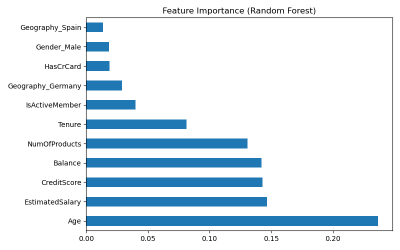
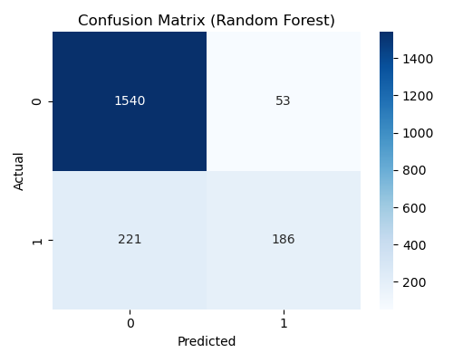

# Customer Churn Prediction – Analysis Report

## 1. Executive Summary

This report presents a predictive churn model for a retail banking customer base. The objective is to identify customers at high risk of leaving and quantify the revenue impact to prioritize retention efforts.

| Key Metric | Value |
|------------|-------|
| **Dataset size** | 10,000 customers |
| **Churn rate** | 20.37% (2,037 churned) |
| **Best model** | Random Forest (AUC 0.85) |
| **Top predictors** | Age, EstimatedSalary, CreditScore, Balance, NumOfProducts |
| **Recall (churn)** | 46% – captures nearly half of actual churners |
| **Precision (churn)** | 78% – high confidence in predicted churners |

The model enables **targeted retention campaigns** by scoring customers on churn probability. Revenue at risk can be estimated as customer value × churn probability for prioritization.

---

## 2. Business Context

Retail banks face significant cost to acquire new customers. Retaining existing customers is typically more profitable than replacing them. Key questions addressed:

- **Which customer segments have the highest churn risk?**
- **What factors predict churn (demographics, products, behavior)?**
- **How can we quantify revenue at risk and prioritize retention spend?**

This analysis supports marketing, product, and finance teams in designing retention strategies and measuring ROI.

---

## 3. Data & Methodology

### 3.1 Data Source

- **Source:** Bank Customer Churn dataset (Kaggle-style schema).
- **Records:** 10,000 customers; 14 columns.
- **Target:** Exited (0 = retained, 1 = churned).
- **Features:** CustomerId, CreditScore, Geography, Gender, Age, Tenure, Balance, NumOfProducts, HasCrCard, IsActiveMember, EstimatedSalary.

### 3.2 Data Quality

- **Missing values:** None.
- **Duplicates:** None (CustomerId unique).
- **Encoding:** One-hot encoding for Geography and Gender.

### 3.3 Methodology

1. **EDA** – Churn by geography, age, product count, balance.
2. **Preprocessing** – Drop non-predictive columns (CustomerId, Surname); scale numeric features.
3. **Train/test split** – 80/20, stratified on Exited.
4. **Models** – Logistic Regression, Random Forest.
5. **Evaluation** – Confusion matrix, ROC-AUC, precision, recall, feature importance.

---

## 4. Key Findings

### 4.1 Churn by Segment

| Segment | Observation |
|---------|-------------|
| **Geography** | Germany shows higher churn than France/Spain |
| **Age** | Older customers (e.g. 45+) churn more frequently |
| **NumOfProducts** | Single-product customers are at higher risk |
| **Balance** | Zero-balance customers may indicate disengagement |
| **IsActiveMember** | Inactive members churn more |

### 4.2 Model Performance

| Model | AUC | Precision (Churn) | Recall (Churn) | Accuracy |
|-------|-----|-------------------|----------------|----------|
| Logistic Regression | 0.77 | 0.59 | 0.19 | 0.81 |
| Random Forest | **0.85** | **0.78** | **0.46** | **0.86** |

**Random Forest** is preferred for its higher discriminative ability and better recall on the churn class.

### 4.3 Feature Importance (Random Forest)

| Rank | Feature | Importance | Interpretation |
|------|---------|------------|----------------|
| 1 | Age | 23.7% | Life-stage and product fit |
| 2 | EstimatedSalary | 14.7% | Value segment; high earners may have more options |
| 3 | CreditScore | 14.3% | Satisfaction / eligibility for products |
| 4 | Balance | 14.2% | Engagement and stickiness |
| 5 | NumOfProducts | 13.1% | Product diversification reduces churn |

**Feature Importance Chart**

### 4.4 Confusion Matrix (Random Forest)

**Takeaway:** The model correctly identifies 46% of churners (recall) with 78% precision. Use predicted churners for targeted retention campaigns; focus on high-value × high-risk customers for maximum ROI.

---

## 5. Main Takeaways

| # | Takeaway |
|---|----------|
| 1 | **Age and product count** are the strongest churn predictors—target older, single-product customers first. |
| 2 | **Germany** shows higher churn; review market-specific value proposition and fees. |
| 3 | **Random Forest (AUC 0.85)** outperforms Logistic Regression; use for production scoring. |
| 4 | **At-risk revenue** = Σ (value × churn prob); prioritize top decile for retention spend. |
| 5 | **Zero-balance, inactive** customers are at risk; onboarding and engagement programs can help. |

---

## 6. Revenue Impact Framework

**At-risk revenue** = Σ (Customer value × Churn probability)

- **Customer value proxy:** EstimatedSalary or Balance (dataset lacks true LTV).
- **Prioritization:** Focus retention budget on high-value, high-risk customers (top decile of risk × value).
- **Target:** Reduce churn in top decile by 10–15% via targeted campaigns.

---

## 7. Limitations

| Limitation | Mitigation |
|------------|------------|
| Imbalanced class (~20% churn) | Threshold tuning or class weights to improve recall |
| No time dimension | Cross-sectional snapshot; consider survival analysis for tenure |
| LTV proxy | EstimatedSalary/balance used; true LTV would improve prioritization |
| Causality | Correlations only; no causal claims without experimentation |

---

## 8. References

- **Dataset:** Bank Customer Churn (Kaggle); local copy as `data/raw/churn.csv`.
- **Code:** `notebooks/01_eda.ipynb`, `02_data_cleaning.ipynb`, `03_analysis.ipynb`; `scripts/run_analysis.py`.
