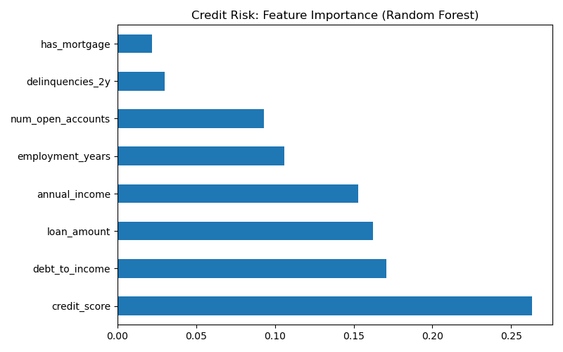
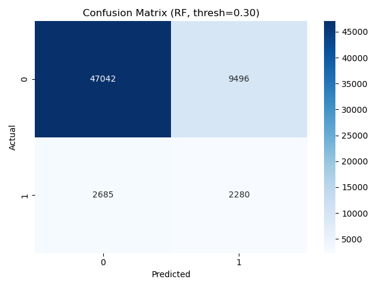

# Credit Risk & Loan Default Prediction

[](.)
[](.)
[](.)

> End-to-end credit risk framework: predict loan defaults, define risk tiers, and translate model outputs into capital impact. **Primary recommendation for ING Air Traffic Control Consultant role.**

---

## 📌 Business Problem

A lending institution needs to predict which applicants will default. **Which characteristics indicate high risk?** How should credit scoring and approval logic work? How do different thresholds impact loss rates and capital requirements?

---

## 📊 Key Results

| Metric | Value |
|--------|-------|
| **Default Rate** | ~11% (sample data) |
| **Models** | Logistic Regression, Random Forest (class_weight for imbalance) |
| **Evaluation** | ROC-AUC, precision-recall, confusion matrix |
| **Risk Tiers** | Low / Medium / High / Critical by default probability |

### Feature Importance



### Confusion Matrix



---

## 🚀 Quick Start

```bash
cd 02-credit-risk-prediction
pip install -r requirements.txt
python scripts/run_analysis.py
```

**Data:** Script auto-generates sample data. Replace with [Kaggle Lending Club](https://www.kaggle.com/datasets/omermetinn/loans-data-set) for production use.

---

## 📁 Deliverables

| Deliverable | Location |
|-------------|----------|
| Data Generation | `scripts/generate_sample_data.py` |
| Full Pipeline | `scripts/run_analysis.py` |
| SQL Analysis | `sql/queries.sql` |
| Risk Tiers | Low (0–20%), Medium (20–50%), High (50–80%), Critical (80%+) |
| Reports | `reports/analysis_report.md`, `business_recommendations.md` |

---

## 🛠️ Tech Stack

Python • Pandas • Scikit-learn • Matplotlib • Seaborn • SQL

---

## 🎯 Why This Matters for ING COO Risk

- **Core function:** Credit risk modeling, RWA, provisions
- **Process:** Model design → implementation → validation → post-production monitoring
- **Skills:** Imbalanced data, ROC-AUC, risk segmentation, regulatory alignment
