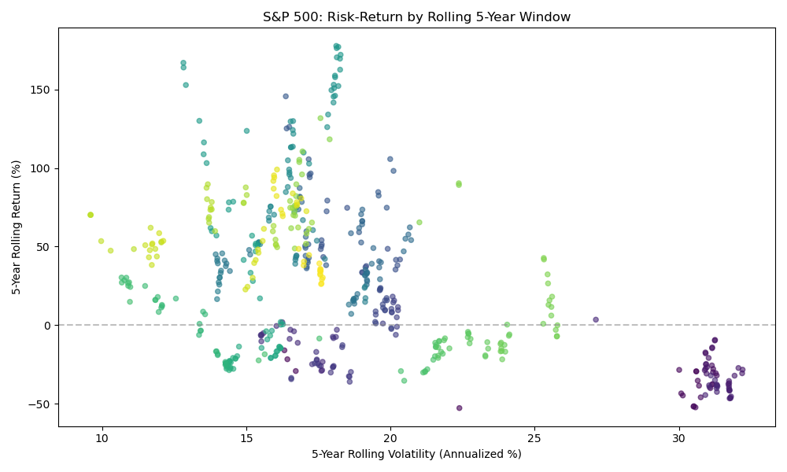
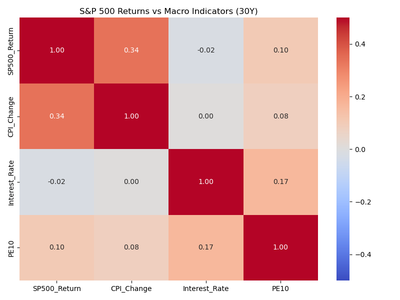
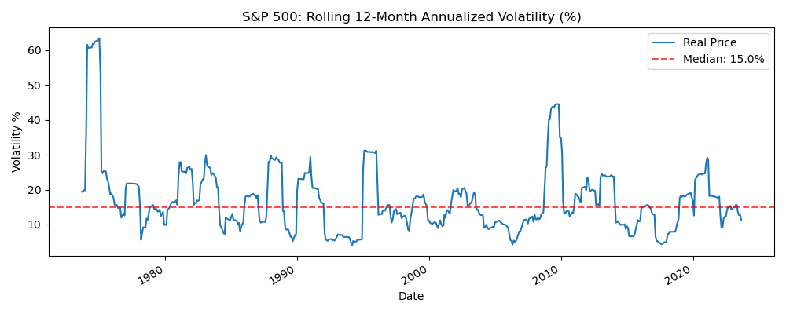

# Financial Data Analysis – Stock Volatility & Portfolio Performance

[](.)
[](.)
[](.)

> Risk-return analysis of S&P 500 stocks using **live data**. Volatility, correlation, and portfolio thinking. **Secondary recommendation for ING Air Traffic Control Consultant role.**

---

## 📌 Business Problem

Analyze stock volatility across sectors. **Which stocks show high volatility risk?** What is the risk-return tradeoff? How can we support portfolio allocation and enterprise risk decisions?

---

## 📊 Key Outputs

| Output | Description |
|--------|-------------|
| **Risk-Return Scatter** | Annualized return vs. volatility by stock |
| **Correlation Matrix** | Diversification opportunities |
| **Volatility Trends** | Rolling 20-day annualized volatility over time |

### Risk-Return Profile



### Correlation Heatmap



### Volatility Over Time



---

## 🚀 Quick Start

```bash
cd 03-financial-data-analysis
pip install -r requirements.txt
python scripts/run_analysis.py
```

**Data:** Fetched automatically via **yfinance** (AAPL, MSFT, GOOGL, AMZN, JPM, etc.). No manual download.

---

## 📁 Deliverables

| Deliverable | Location |
|-------------|----------|
| Data Fetch | yfinance (last 2 years) |
| Analysis | `scripts/run_analysis.py` |
| Outputs | `visualizations/`, `data/processed/` |

---

## 🛠️ Tech Stack

Python • Pandas • NumPy • Matplotlib • Seaborn • yfinance

---

## 🎯 Why This Matters for ING COO Risk

- **Risk metrics:** Volatility, correlation, risk-return
- **Portfolio thinking:** Credit risk as portfolio phenomenon
- **Quantitative rigor:** Data-driven recommendations
