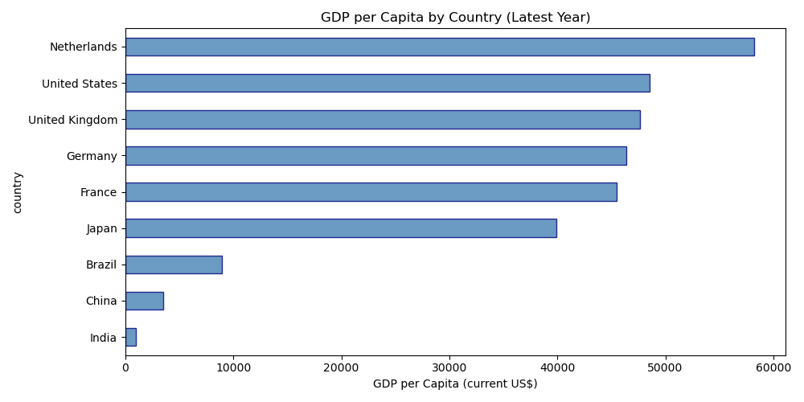
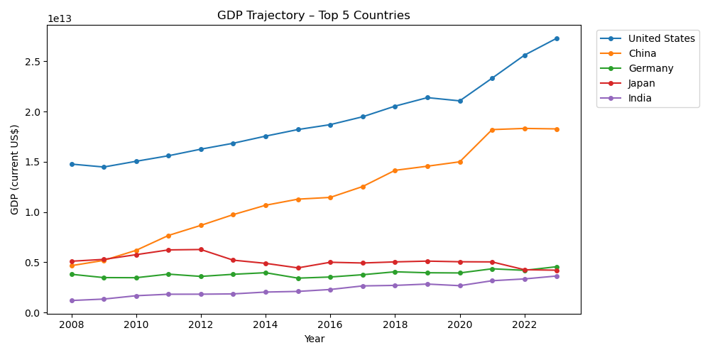
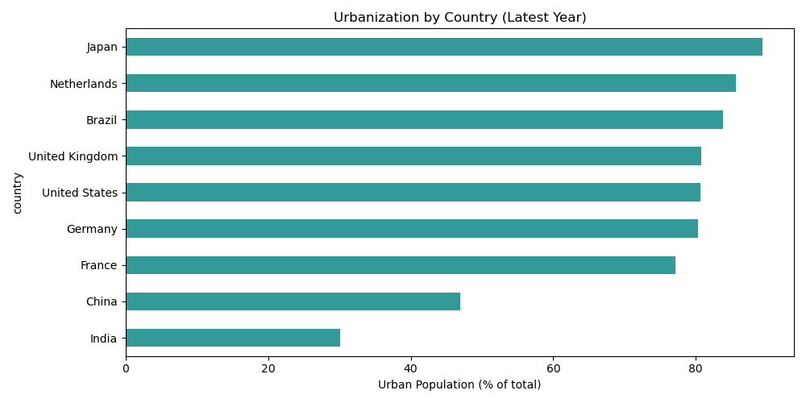

# Geographic & Regional Performance Benchmarking

[](.)
[](.)
[](.)

> Multi-country economic indicator analysis using **World Bank Development Indicators**. GDP, GDP per capita, urbanization—market comparison and strategic planning. **Relevant for ING's operations in 40+ countries.**

---

## 📌 Business Problem

A multinational bank wants to understand **regional economic differences**. Which markets show strongest growth? What economic indicators predict business opportunity? How should we rank markets for expansion and capital allocation?

---

## 📊 Key Outputs

| Output | Description |
|--------|-------------|
| **GDP per Capita** | By country (latest year) |
| **GDP Trajectory** | Top 5 countries over time |
| **Urbanization** | Urban population % by country |
| **YoY GDP Growth** | Year-over-year growth by country |
| **GDP vs Urbanization** | Scatter plot by country |

### GDP per Capita by Country



### GDP Trajectory



### Urbanization



---

## 🚀 Quick Start

```bash
cd 05-geographic-regional-performance
pip install -r requirements.txt
python scripts/run_analysis.py
```

**Data:** Fetched automatically via **wbdata** (World Bank API). Indicators: GDP, GDP per capita, Urban population %. Countries: USA, Germany, France, UK, Netherlands, Brazil, India, China, Japan. Period: 2008–2023.

**Alternative:** [World Bank DataBank](https://databank.worldbank.org/) – select indicators, countries, time; download CSV/Excel.

---

## 📁 Deliverables

| Deliverable | Location |
|-------------|----------|
| Data Fetch | `scripts/run_analysis.py` (wbdata) |
| Cache | `data/raw/wb_indicators.csv` (if API succeeds) |
| Outputs | `visualizations/`, `data/processed/regional_indicators.csv` |
| Reports | `reports/analysis_report.md`, `business_recommendations.md` |

---

## 🛠️ Tech Stack

Python • Pandas • NumPy • Matplotlib • Seaborn • wbdata

---

## 🎯 Why This Matters for ING

- **Multinational operations:** ING operates in 40+ countries; geographic analysis supports strategy.
- **Market prioritization:** GDP, growth, urbanization inform expansion and resource allocation.
- **Strategic planning:** Transparent methodology; public data (World Bank) for stakeholder alignment.
