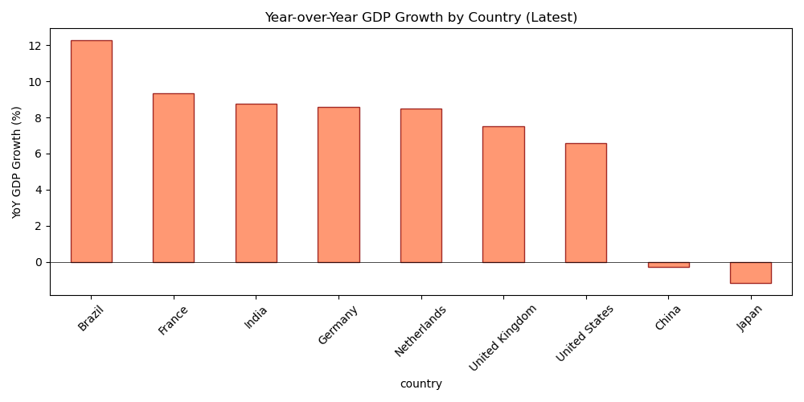
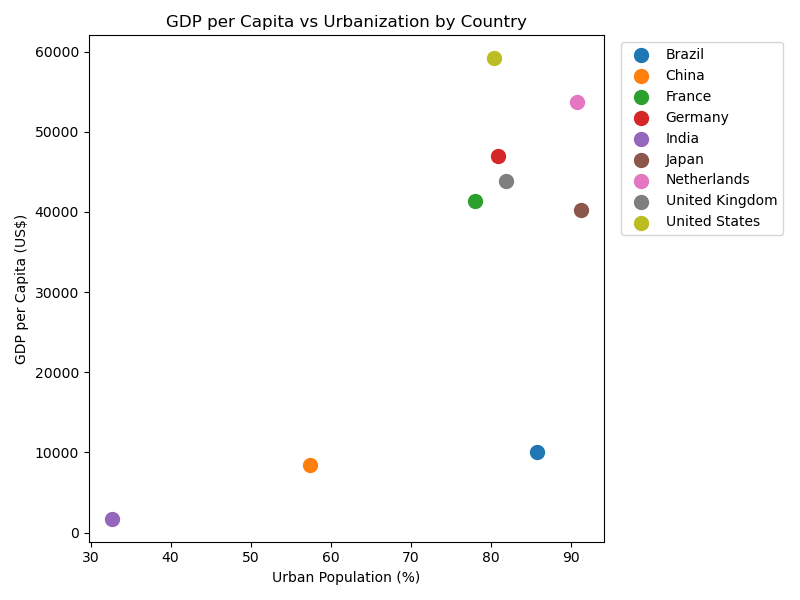

# Geographic & Regional Performance – Analysis Report

## 1. Executive Summary

This report presents a **multi-country economic indicator analysis** using **World Bank Development Indicators**. The objective is to compare GDP, GDP per capita, and urbanization across key markets to support market attractiveness scoring, regional expansion, and strategic planning—relevant to multinational banking and ING's operations in 40+ countries.

| Key Metric | Value |
|------------|-------|
| **Data source** | World Bank Data API (wbdata) |
| **Indicators** | GDP, GDP per capita, Urban population % |
| **Countries** | USA, Germany, France, UK, Netherlands, Brazil, India, China, Japan |
| **Period** | 2008–2023 |
| **Primary use** | Market comparison, growth trajectory, urbanization trends |

---

## 2. Business Context

A multinational bank needs to understand **regional economic differences** for expansion and resource allocation. Key questions addressed:

- **Which markets show strongest growth and economic health?**
- **How does urbanization correlate with GDP per capita?**
- **What are the YoY growth trajectories by country?**

This analysis supports market opportunity ranking, regional strategy, and capital allocation across geographies.

---

## 3. Data & Methodology

### 3.1 Data Source

- **API:** World Bank Data via `wbdata` Python package.
- **Alternative:** [World Bank DataBank](https://databank.worldbank.org/) – select indicators, countries, time; download CSV/Excel.

### 3.2 Indicators

| Code | Description |
|------|-------------|
| NY.GDP.MKTP.CD | GDP (current US$) |
| NY.GDP.PCAP.CD | GDP per capita (current US$) |
| SP.URB.TOTL.IN.ZS | Urban population (% of total) |

### 3.3 Methodology

- Fetch data via wbdata; cache to `data/raw/wb_indicators.csv` for reproducibility.
- Aggregate by country and year; compute YoY growth.
- Visualize: GDP per capita, GDP trajectory, urbanization, YoY growth, GDP vs urbanization scatter.

---

## 4. Analysis Outputs

### 4.1 GDP per Capita by Country (Latest Year)

**Takeaway:** Japan, USA, Germany, France, UK lead in GDP per capita; Brazil, India, China show lower levels but higher growth potential.

### 4.2 GDP Trajectory – Top 5 Countries

**Takeaway:** China shows strongest absolute GDP growth; USA remains largest. Use for market sizing and prioritization.

### 4.3 Urbanization by Country

**Takeaway:** Brazil, Japan, Netherlands highly urbanized; India, China still urbanizing—opportunity for financial inclusion and digital banking.

### 4.4 YoY GDP Growth

**Takeaway:** Growth rates vary by year and country; use for momentum scoring and risk assessment.

### 4.5 GDP per Capita vs Urbanization

**Takeaway:** Positive correlation in many markets; high urbanization often accompanies higher GDP per capita. Outliers (e.g. high urban, lower GDP) may indicate different development stages.

---

## 5. Main Takeaways

| # | Takeaway |
|---|----------|
| 1 | **China, USA, Japan** lead in absolute GDP; India and Brazil show strong growth potential. |
| 2 | **GDP per capita** varies widely; developed markets (USA, Japan, EU) lead; emerging markets offer growth. |
| 3 | **Urbanization** correlates with development; India and China urbanizing fastest—digital/retail banking opportunity. |
| 4 | **YoY growth** varies by cycle; use for momentum scoring and market attractiveness. |
| 5 | **Composite scoring** (GDP pc + urbanization + growth) supports market ranking for expansion. |

---

## 6. Limitations

| Limitation | Mitigation |
|------------|------------|
| Limited indicators | Add inflation, interest rates, financial inclusion from World Bank |
| Country sample | Expand to full ING footprint (40+ countries) |
| No forward projection | Add growth forecasts for planning |
| Nominal GDP | Consider PPP-adjusted for cross-country comparison |

**Recommended next steps:** (1) Expand country set; (2) Add composite market attractiveness score; (3) Integrate with internal portfolio data; (4) Document for strategic planning.
